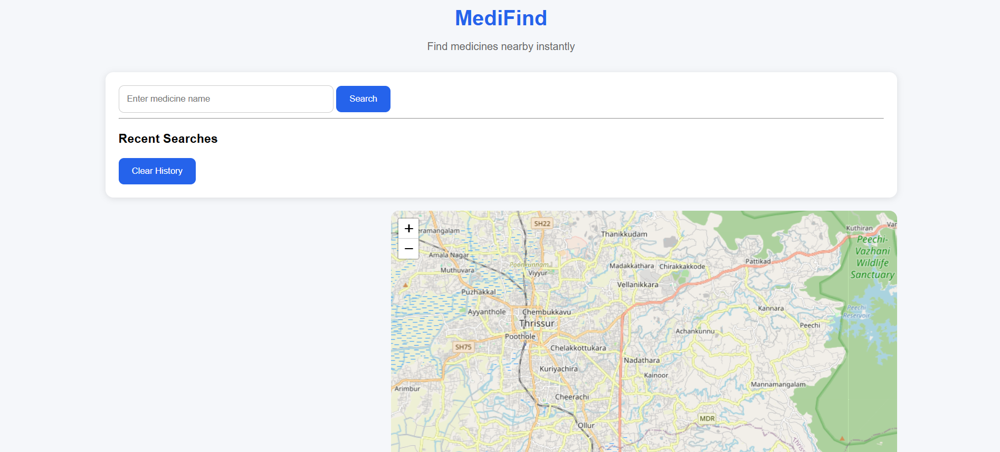
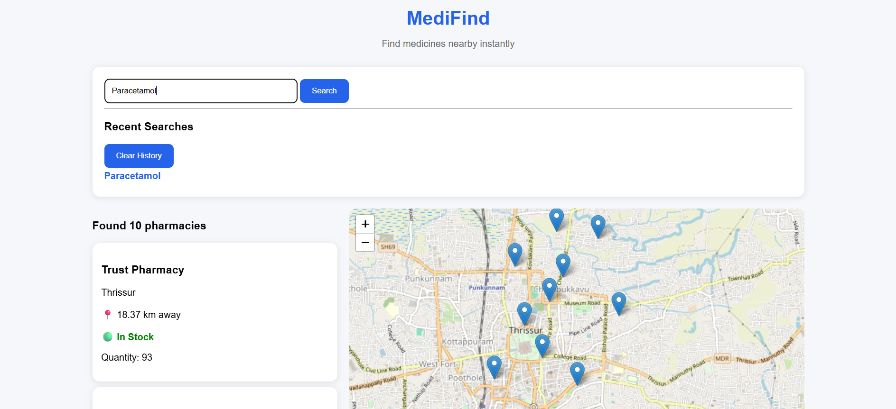
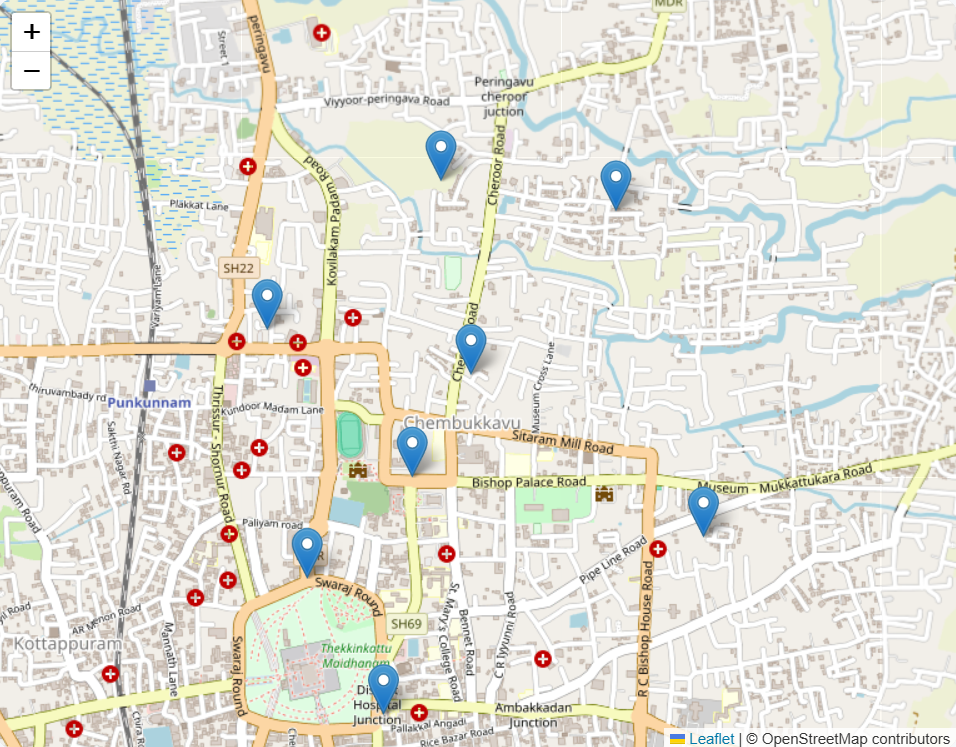

# MediFind

MediFind helps users locate nearby pharmacies that stock a required medicine.

## Features

- Search medicines
- View pharmacies with stock availability
- Distance calculation
- Interactive map using Leaflet
- Recent search history
- Search using Enter key
- Pharmacy stock information

## Tech Stack

Frontend:
- HTML
- CSS
- JavaScript
- Leaflet Maps

Backend:
- Flask
- SQLite

## Live Demo

Frontend:
https://mee-nakshiii.github.io/medifind/

Backend:
https://medifind-backend-sn9d.onrender.com/

## Screenshots

### Home Page

### Search Results

### Map View

